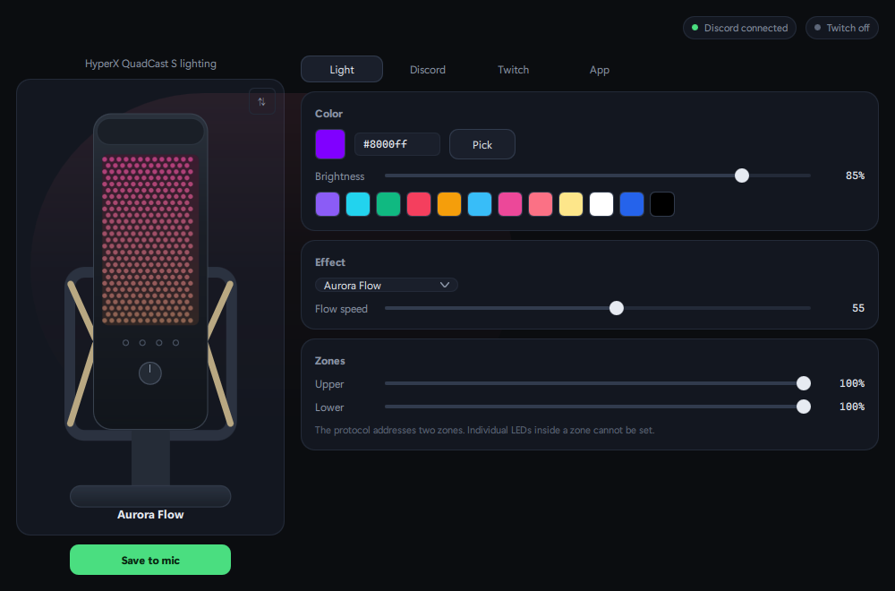
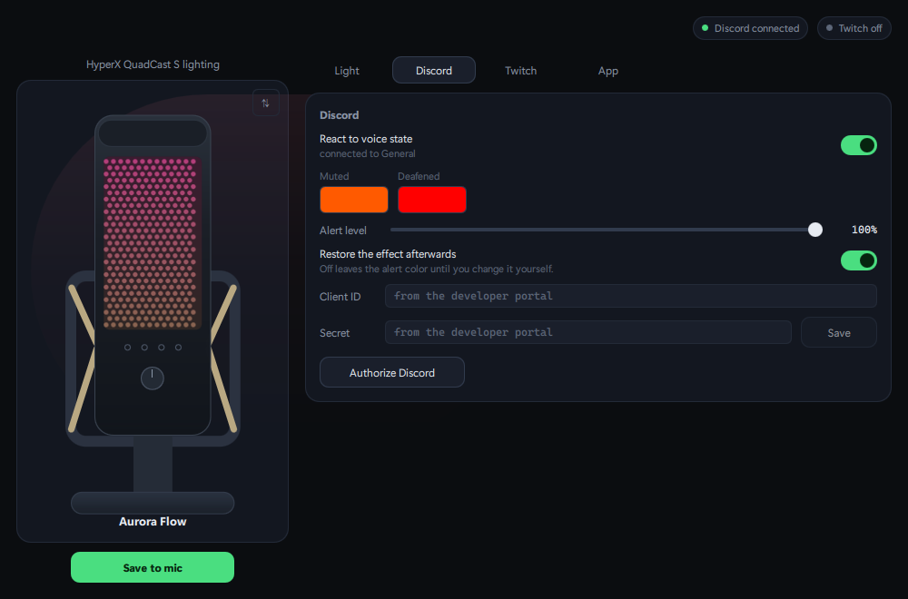
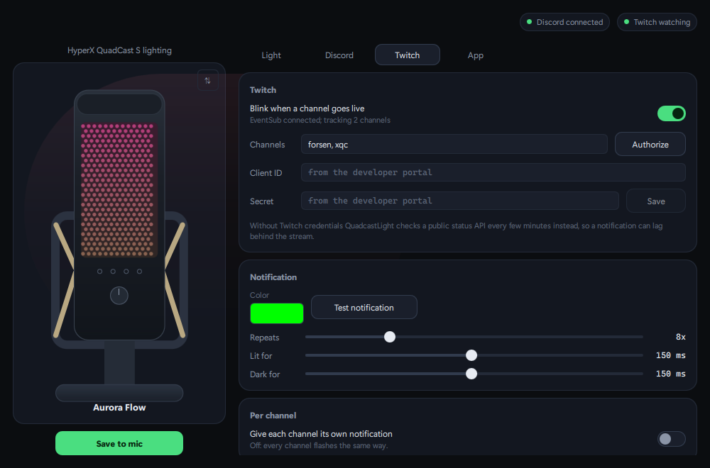
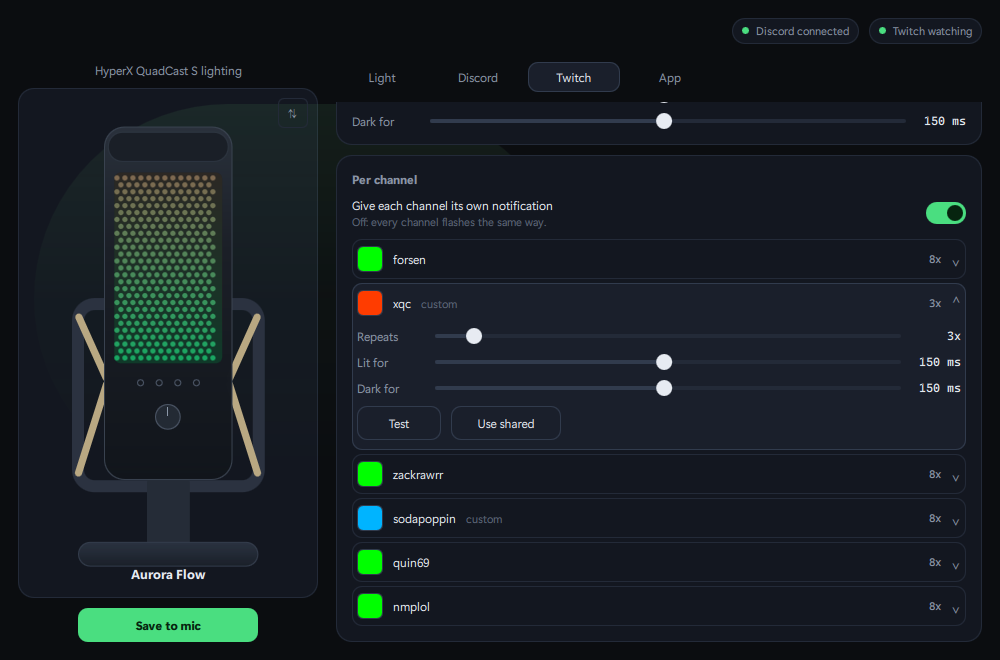

# QuadcastLight

Lighting control for the HyperX QuadCast S on Windows, without NGENUITY.

It also reacts: mute yourself in Discord and the mic turns orange, unmute and
your effect comes back. When a Twitch channel you watch goes live, it flashes.



The microphone on screen is not a colour swatch. It shows the same frames that
are going to the device, so it dims when you lower the brightness, turns red
when Discord mutes, and goes grey when you unplug the real one.

## Requirements

Windows and Python 3.12. Close NGENUITY first: two programs writing to the mic
fight over it and the light flickers.

The lighting lives on a second USB device, `03F0:028C`. If your QuadCast does
not present it, this will not find anything to talk to.

## Install

```
git clone https://github.com/Arkanoidvfx/Quadcast-light.git
cd Quadcast-light
python -m venv .venv
.venv\Scripts\pip install -r requirements.txt
```

Note it is `hidapi`, not the similarly named `hid` package. Both claim the
import name `hid` and only one of them works here.

## Run

```
miclight-gui.cmd
```

Closing the window puts it in the tray and leaves the automations running. Exit
from the tray menu to quit properly.

Every control applies to the mic as you move it, so there is no apply button.
The one button, **Save to mic**, writes the colour that is showing into the
microphone's own memory, which is what it falls back to when nothing is running.

Two flags, for running it under a supervisor: `--show` raises the window of an
instance that is already running, and `--no-tray` starts it without a tray icon.

## Discord



1. Create an application at <https://discord.com/developers/applications>
2. Add `http://localhost` as a redirect URI
3. Put the Client ID and Client Secret in the Discord tab and press **Save**
4. Start the Discord desktop app and press **Authorize Discord**

It talks to the Discord client on your machine over its local pipe. Nothing goes
anywhere else. Access tokens last a week and are refreshed on their own; if a
refresh fails, the window says so instead of going quiet.

The secret and both tokens are encrypted with Windows DPAPI, readable only by
your Windows account.

## Twitch



Add the channels you want to watch. Without credentials it checks a public
status API every few minutes, so a notification can arrive late; with them it
uses Twitch's EventSub and reacts at once.

1. Create an app at <https://dev.twitch.tv/console/apps>
2. Set the OAuth redirect URL to `http://localhost:4343/oauth/callback`
3. Enter the Client ID and Secret, then press **Authorize**



By default every channel flashes the same way. Turn on **Give each channel its
own notification** and each gets a row you can open. Whatever you leave alone
keeps following the shared settings, so changing the shared colour still moves
every channel you have not given one of its own.

## What it cannot do

The microphone stores one colour, not an effect. Its memory looks like it should
hold an animation, and it does not; the evidence is in
[docs/PROTOCOL.md](docs/PROTOCOL.md). An effect plays only while something is
driving the device, which in practice means while this is running in the tray.

Brightness is the host multiplying the colour before sending it, the way
NGENUITY does it, so at very low brightness the animation has few levels to work
with and looks coarse. That is the 8-bit device, not the software.

## Command line

```
miclight.cmd set ff0000 -b 60
```

| Command | |
|---|---|
| `set <color> [-b 0-100] [--lower COLOR]` | hold a colour in the background |
| `animate <preset> <color> [-b N] [--palette a,b,c]` | run an animation |
| `save <color> [-b N]` | write it to the mic's memory |
| `blink <color> [--times N]` | flash a few times, then stop |
| `off` | LEDs off |
| `stop` | release the mic |
| `status` | device and writer state |

Colours are hex `RRGGBB` or a name: red, green, blue, white, orange, purple,
cyan, magenta, yellow, pink, warmwhite, black, off.

## Files it writes

```
%APPDATA%\QuadcastLight\gui.json      colour, effect, zones. No secrets.
%APPDATA%\QuadcastLight\discord.json  credentials, DPAPI encrypted
%APPDATA%\QuadcastLight\twitch.json   credentials and watched channels
%APPDATA%\QuadcastLight\logs\         start here when an automation goes quiet
```

## Working on it

```
.venv\Scripts\python -m unittest discover -s . -p "test_*.py"
```

No microphone needed; the device is faked. `test_protocol.py` also holds a
six-second smoke test against real hardware, which runs only if you execute that
file directly.

One thread owns the HID handle and writes the current program twenty times a
second, because the mic falls back to its stored colour if the host goes quiet
for about a second. Everything else hands that thread a program: `set_program`
for the standing one, your effect or a Discord state, and `flash` for a
temporary override that reverts by itself. A mute landing during a notification
needs no queue, because the flash returns to whatever the standing program is by
then.

```
quadcastlight/
  device.py            HID transport and packet layout
  effects.py           colour maths and animation frames
  engine.py            the single writer
  policy.py            what should be lit, given settings and voice state
  settings.py          gui.json, validated and written atomically
  integrations/        discord.py, twitch.py
  ui/                  Qt Quick window, tray, and the bridge to the engine
miclight.py            command line
miclight_gui.pyw       entry point
```

The protocol is written up in [docs/PROTOCOL.md](docs/PROTOCOL.md), including
the parts that turned out not to work.

## Licence

MIT, see [LICENSE](LICENSE).

The protocol was checked against [OpenRGB](https://openrgb.org/) and
[QuadcastRGB](https://github.com/Ors1mer/QuadcastRGB), which is GPL. No code came
from either, only the wire format. PySide6 is LGPL, used as an ordinary pip
dependency.

Not affiliated with HP or HyperX.
